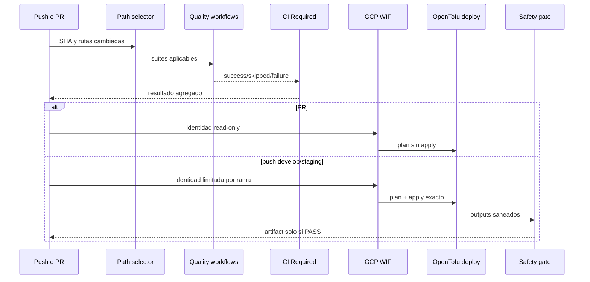

# Pipelines de GitHub Actions

[`ci-required.yml`](ci-required.yml) es el orquestador. Clasifica rutas, llama
workflows reutilizables y permite desplegar solo después de `CI Required`.

## Inventario

| Workflow | Trigger/consumidor | Responsabilidad |
|---|---|---|
| `ci-required.yml` | Push y PR a ramas protegidas | Selección, quality gate y promociones |
| `opentofu-ci.yml` | Orquestador | Validación offline y plan GCP read-only en PR |
| `gcp-managed-deploy.yml` | Develop/staging después de CI | Foundation, imágenes, secretos, Cloud Run y evidencia |
| `staging-preview.yml` | PR aplicable o push staging | QA runner-private de siete fases |
| `gcp-production-deploy.yml` | Quality Pipeline exitoso en main | Producción vigente sobre VM |
| `backend-ci.yml` | Orquestador | Build, unitarias, API, integración y cobertura |
| `frontend-ci.yml` | Orquestador | Build y unitarias |
| `playwright-e2e.yml` | Orquestador | E2E y evidencia controlada |
| `security-testing.yml` | Orquestador | Trivy y ZAP |

## Gates posteriores a CI

Los jobs posteriores usan `always()` porque un job intencionalmente omitido,
como Conventional Commits en un push, se propaga por la cadena `needs`. El
`always()` solo evita esa omisión automática: cada deploy exige explícitamente
`needs.ci-required.result == 'success'`; staging administrado exige además que
el preview termine en `success`.

| Ref | Acción |
|---|---|
| Pull request | Plan GCP read-only; nunca `apply` |
| `refs/heads/develop` | Platform + ambiente development |
| `refs/heads/staging` | Preview QA + ambiente staging |
| `refs/heads/main` | Ruta productiva VM con aprobación |

