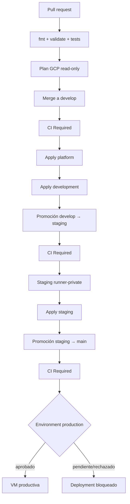
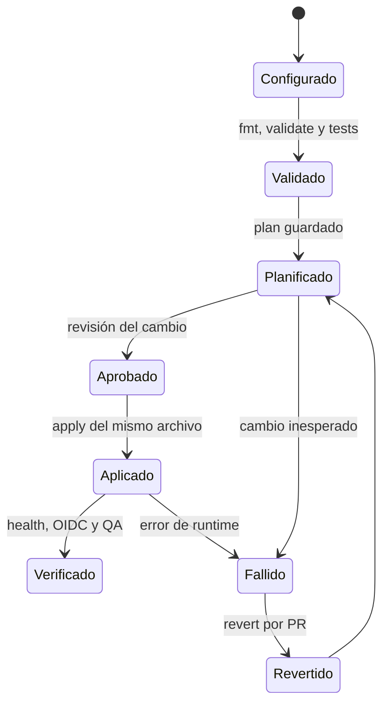

# Runbook de ambientes administrados en GCP

## Estado verificable

Esta guía distingue infraestructura declarada, infraestructura aplicada y
servicios funcionales. No se considera desplegado lo que solo exista en un
archivo `.tf`.

| Ambiente | Rama | Runtime vigente | Estado OpenTofu al 2026-07-29 |
|---|---|---|---|
| development | `develop` | Cloud Run, pendiente de activación | foundation aplicada; plan posterior `No changes` |
| staging | `staging` | runner privado/Compose y foundation GCP paralela | foundation aplicada; plan posterior `No changes` |
| production | `main` | VM `qa-inventario` | Cloud Run solo planificado: 32 altas, 0 cambios, 0 destrucciones |

`deploy_services=false` significa que VPC, Cloud SQL privado, bases, cuentas de
servicio, contenedores de secretos e IAM existen, pero no afirma que la
aplicación responda en Cloud Run.

Los jobs posteriores a CI usan `always()` para que un gate no se omita por una
dependencia anterior marcada legítimamente como `skipped`. Esto no permite
desplegar tras un fallo: development y staging exigen explícitamente
`needs.ci-required.result == 'success'`, y staging administrado exige además el
preview exitoso.
El plan GCP de solo lectura del PR #145 pasó en el run
[30508694249](https://github.com/xPshycho/qa_gestion_inventarios/actions/runs/30508694249).
En el primer push posterior a `develop`, run
[30509955395](https://github.com/xPshycho/qa_gestion_inventarios/actions/runs/30509955395),
`GCP managed development after CI` quedó `skipped`. Por tanto, el wiring está
versionado, pero el `apply` automático es **Pendiente de verificación**.

## Flujo de promoción

```text
pull request
  └─ fmt + validate + tests + plan GCP de solo lectura

merge a develop
  └─ CI Required ── apply plataforma ── apply development

## Flujo de promoción



Un PR obtiene una credencial OIDC efímera mediante Workload Identity
Federation. No se guarda una llave JSON ni un access token en el repositorio.
El nombre del provider y el correo de la cuenta de servicio son identificadores
no sensibles y pueden ser variables; passwords, client secrets y tokens
reutilizables deben permanecer en GitHub Environment secrets o Secret Manager.

## Configuración de GitHub

Variables de repositorio:

| Variable | Propósito |
|---|---|
| `GCP_PROJECT_ID` | proyecto administrado |
| `GCP_REGION` | región común |
| `GCP_STATE_BUCKET` | bucket remoto |
| `GCP_ARTIFACT_REPOSITORY` | repositorio Docker |
| `GCP_CLOUD_SQL_PROXY_IMAGE` | imagen fijada por digest |
| `GCP_PLAN_WORKLOAD_IDENTITY_PROVIDER` | provider restringido a `refs/pull/*` |
| `GCP_PLAN_SERVICE_ACCOUNT` | identidad read-only |
| `GCP_DEVELOPMENT_WORKLOAD_IDENTITY_PROVIDER` | provider de `refs/heads/develop` |
| `GCP_DEVELOPMENT_DEPLOY_SERVICE_ACCOUNT` | deployer development |
| `GCP_STAGING_WORKLOAD_IDENTITY_PROVIDER` | provider de `refs/heads/staging` |
| `GCP_STAGING_DEPLOY_SERVICE_ACCOUNT` | deployer staging |
| `GCP_DEVELOPMENT_DEPLOY_SERVICES` | `false` hasta completar secretos |
| `GCP_STAGING_DEPLOY_SERVICES` | `false` hasta completar secretos |

Los Environments `development`, `staging` y `production` separan secretos y
aprobaciones. `production` conserva required reviewers y solo acepta
`main`. Staging debe requerir revisión antes de una promoción de entrega; en
development la revisión puede ser opcional para mantener retroalimentación
rápida.

Secretos por Environment para activar servicios:

```text
INVENTORY_DB_PASSWORD
KEYCLOAK_DB_PASSWORD
KEYCLOAK_ADMIN_PASSWORD
KEYCLOAK_ADMIN_CLIENT_SECRET
E2E_ADMIN_PASSWORD
E2E_OPERATOR_PASSWORD
E2E_VIEWER_PASSWORD
E2E_AUDITOR_PASSWORD
```

Cada valor debe tener al menos 16 caracteres. No imprimirlos, pasarlos como
outputs, copiarlos a artifacts ni guardarlos en `.tfvars`.

## Preparar y comprobar un ambiente



El estado `Aplicado` prueba infraestructura; `Verificado` requiere comprobar
el runtime y las suites correspondientes.

Validación offline:

```bash
make test-infra
/tmp/actionlint-1.7.7/actionlint
```

Plan administrativo reproducible:

```bash
export GCP_PROJECT_ID="PROJECT_ID"
export GCP_REGION="us-central1"
export GCP_STATE_BUCKET="STATE_BUCKET"
export GCP_ARTIFACT_REPOSITORY="inventory-images"
export DEPLOY_SERVICES="false"

config_dir="$(mktemp -d)"
./scripts/opentofu/render-ci-config.sh development "$config_dir"
./scripts/opentofu/plan.sh \
  development \
  "$config_dir/backend.hcl" \
  "$config_dir/terraform.tfvars" \
  "$config_dir/development.tfplan"
tofu -chdir=infra/opentofu/environments/development show \
  -no-color "$config_dir/development.tfplan"
```

Aceptar solamente el plan inspeccionado. Si contiene una destrucción o
reemplazo inesperado, detenerse y reconciliar import/state/configuración. Para
aplicar:

```bash
tofu -chdir=infra/opentofu/environments/development apply \
  -input=false "$config_dir/development.tfplan"
```

No generar otro plan entre aprobación y `apply`.

## Primera activación de Cloud Run

1. Crear los ocho secretos en el GitHub Environment correcto.
2. Ejecutar el workflow con `deploy_services=false` y confirmar foundation sin
   deriva.
3. Cambiar `GCP_<ENV>_DEPLOY_SERVICES` a `true`.
4. Aprobar el Environment si aplica.
5. El workflow construye imágenes con el SHA, publica en Artifact Registry y
   resuelve digests.
6. `seed-runtime-secrets.sh` crea únicamente versiones faltantes, verifica que
   todas compartan el mismo número y sincroniza los usuarios PostgreSQL.
7. Un segundo plan activa Cloud Run con referencias `@sha256`.
8. Los checks validan health web y discovery OIDC.

Verificación independiente:

```bash
gcloud sql instances describe "inventory-ENV-postgres" \
  --project="PROJECT_ID" \
  --format='yaml(state,databaseVersion,settings.availabilityType,settings.ipConfiguration)'

gcloud run services list \
  --project="PROJECT_ID" \
  --region="us-central1" \
  --filter='metadata.name:inventory-ENV-'
```

Para aceptar el runtime deben pasar también autenticación, matriz de roles,
API, Playwright, ZAP y k6 contra las URLs de ese ambiente. La existencia de
Cloud Run o un health aislado no sustituye esas pruebas.

## Rollback

Infraestructura:

1. identificar el último SHA aprobado;
2. revertir por PR, nunca modificar state a mano;
3. inspeccionar el plan de reversión;
4. aplicar el archivo guardado exacto desde la rama autorizada;
5. repetir health y pruebas post-deploy.

Aplicación:

1. localizar los digests del SHA anterior en Artifact Registry;
2. restaurarlos en las variables generadas;
3. planificar y aplicar una nueva revisión Cloud Run;
4. conservar la revisión defectuosa sin tráfico hasta terminar el análisis.

Producción VM conserva su procedimiento de
[`gcp-vm.md`](gcp-vm.md); no se mezcla un rollback de VM con el state de Cloud
Run.

## Rotación de secretos

1. generar los ocho valores nuevos dentro del Environment;
2. añadir una versión por secreto sin deshabilitar la anterior;
3. cambiar ambos usuarios de base;
4. comprobar que todos los números de versión coinciden;
5. planificar Cloud Run con `secret_version` numérico;
6. aplicar y probar;
7. deshabilitar versiones anteriores solo después del periodo de rollback.

Ante una rotación parcial, mantener `deploy_services=false` o la revisión
anterior. Nunca usar `latest`.

## Incidentes de state

Si existe un lock:

1. comprobar Actions y sesiones administrativas;
2. confirmar el root y prefijo exactos;
3. esperar a que termine cualquier escritor;
4. usar `tofu force-unlock LOCK_ID` solo si el proceso propietario ya no existe;
5. ejecutar un plan y exigir ausencia de destrucciones inesperadas.

Si el plan propone recrear recursos que existen:

1. detener el apply;
2. comparar `tofu state list` con GCP;
3. importar recursos preexistentes con su ID oficial;
4. volver a planificar;
5. aplicar únicamente cuando el resultado sea aditivo o el cambio destructivo
   esté explícitamente aprobado.

El bucket tiene versionado. La recuperación restaura una generación anterior
como generación nueva; no se usa `state push -force` como operación normal.

## Evidencia y trazabilidad

El workflow crea:

```text
gcp-managed-<environment>-<SHA>-<run_attempt>/
└── gcp-managed/<environment>/
    ├── deployment.json
    └── opentofu-output.json
```

El artifact se publica solo después de `verify-artifacts.sh`. No contiene
planes, `.terraform`, HTML, traces, videos, HAR, passwords ni credenciales.

| Requisito | Implementación | Prueba | Evidencia |
|---|---|---|---|
| PR no modifica GCP | `opentofu-ci.yml` usa plan read-only | check `Read-only GCP plan` | run del PR |
| rama aislada | providers WIF condicionados por ref e IDs | rechazo de ref en workflow | logs de auth/config sin token |
| apply exacto | `plan.sh` + archivo `.tfplan` | plan y apply del mismo run | `deployment.json` |
| imagen inmutable | build SHA y resolución de digest | regex `@sha256` | outputs OpenTofu |
| state separado | prefijos platform/env | plan por los cuatro roots | backend GCS |
| secretos fuera de state | solo contenedores en OpenTofu | secret scanning + safety | checks Gitleaks/artifact |
| recovery | este runbook | simulación controlada | issue/run enlazado |

## Responsabilidad y cierre

- #107 se puede cerrar cuando el PR esté fusionado y los workflows de
  development, staging y producción pasen según su ruta híbrida.
- #109 se puede cerrar cuando otro integrante ejecute este runbook y confirme
  que puede preparar development sin versionar secretos.
- #91 permanece abierto hasta consolidar todas las áreas del proyecto y
  adjuntar evidencia final del SHA promovido a producción; este runbook cubre
  únicamente la parte GCP/OpenTofu.
