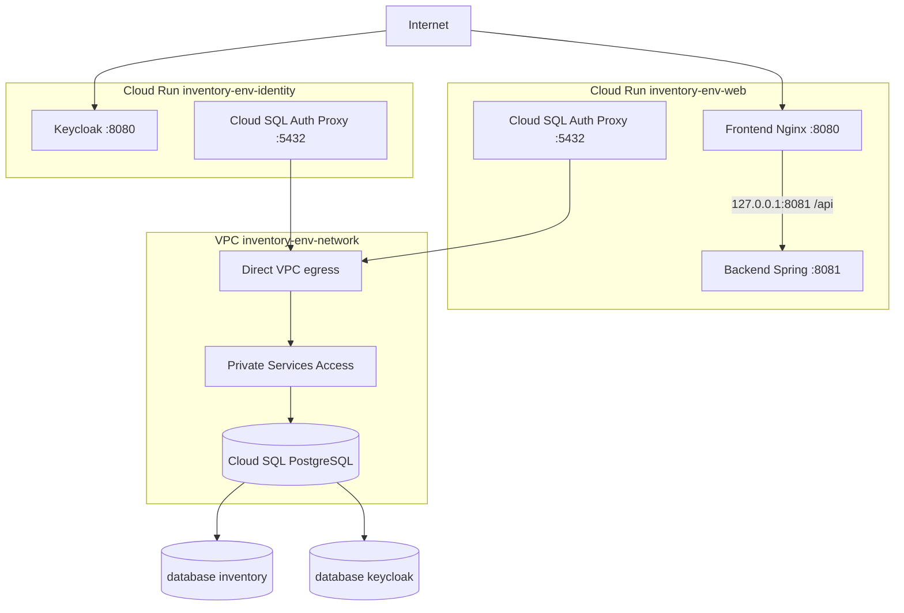

# Base GCP declarativa con OpenTofu

> **Estado operativo actualizado el 29-07-2026:** #106 está cerrado y el PR
> #145 incorporó planes GCP de solo lectura para pull requests y jobs de
> `apply` para `development` y `staging`. El plan read-only pasó en el PR, pero
> el primer job post-merge de development quedó `skipped`; #107 permanece
> abierto hasta diagnosticar y validar el `apply`. La producción vigente sigue
> siendo la VM y staging conserva además su preview runner-private. Use la
> [guía operativa #109](../27-guia-operativa-gcp-opentofu.md) para estado,
> aprobaciones, incidentes, recuperación y trazabilidad.

## Propósito y estado

Esta guía implementa la base declarativa del issue #106 y su automatización
operativa de los issues #107 y #109:

- Artifact Registry para imágenes inmutables;
- Cloud Run para aplicación e identidad;
- Cloud SQL PostgreSQL;
- cuentas de servicio e IAM de mínimo privilegio;
- Secret Manager sin valores sensibles dentro del state;
- state remoto GCS separado para plataforma y cada ambiente;
- validación y planes revisables antes de cualquier `apply`.

El 29 de julio de 2026 se aplicaron las foundations de `development` y
`staging` en `project-e70349a8-c787-4733-9a0`. Un plan posterior de ambos
ambientes terminó en `No changes`. Cloud Run permanece desactivado hasta cargar
las ocho versiones de secretos y crear los dos usuarios PostgreSQL por
ambiente. El plan administrado de `production` propone 32 altas, cero cambios
y cero destrucciones, pero **no se aplicó**.

La VM descrita en [`gcp-vm.md`](gcp-vm.md) continúa siendo la producción
vigente y el workflow `gcp-production-deploy.yml` conserva la ruta
`main` → `production`. La plataforma administrada se valida primero en
development y staging; cambiar el tráfico productivo a Cloud Run requiere una
decisión de migración separada.

El procedimiento diario, variables, aprobaciones, rollback, incidentes y
evidencias se encuentran en
[`gcp-managed-environments.md`](gcp-managed-environments.md).

## Decisiones de arquitectura



El frontend y backend comparten una instancia Cloud Run. Nginx conserva el
contrato público `/api/` y reenvía a `127.0.0.1:8081`; el navegador no necesita
una segunda URL ni CORS entre frontend y API. `BACKEND_UPSTREAM` conserva
`backend:8080` como valor por defecto para Docker Compose.

Cloud Run usa Direct VPC egress para alcanzar la dirección privada de Cloud
SQL. La instancia no recibe IPv4 pública, no define `authorized_networks` y
acepta solamente conexiones cifradas. El Auth Proxy añade autenticación IAM y
TLS sobre esa ruta privada.

Keycloak permanece separado porque es un origen OAuth público y tiene ciclo de
vida distinto. Los proxies de Cloud SQL autentican el transporte mediante la
identidad runtime; PostgreSQL autentica los usuarios de aplicación mediante
passwords almacenados en Secret Manager.

La imagen de identidad se construye desde
[`infra/keycloak/Dockerfile`](../../infra/keycloak/Dockerfile). El realm se
incluye con placeholders; ningún valor secreto forma parte de la imagen.

El Compose local y el staging runner-private conservan Prometheus, Grafana,
Loki, Tempo, Alloy y Alertmanager para la evidencia QA. #106 no intenta
ejecutar ese stack persistente como sidecars de Cloud Run. Los runtimes reciben
`logging.logWriter` y `monitoring.metricWriter`.

## Aislamiento

Un proyecto GCP puede alojar inicialmente los tres ambientes, pero cada uno
tiene:

- prefijo de nombres propio;
- instancia Cloud SQL, bases y usuarios propios;
- VPC, subred serverless y rango de Private Services Access propios;
- secretos y cuentas runtime propios;
- servicios y escalado Cloud Run propios;
- state GCS independiente.

Los roots también aceptan distintos `project_id`. En una separación por
proyectos se debe aplicar `platform/` por proyecto o autorizar expresamente a
los service agents para leer un Artifact Registry central.

## Inventario de state

| Root | Backend | Prefix |
|---|---|---|
| `bootstrap/` | local, custodiado por el operador | no aplica |
| `platform/` | GCS | `inventory/platform` |
| `environments/development/` | GCS | `inventory/environments/development` |
| `environments/staging/` | GCS | `inventory/environments/staging` |
| `environments/production/` | GCS | `inventory/environments/production` |

El bucket tiene uniform bucket-level access, prevención de acceso público,
versionado, retención de 20 versiones archivadas por objeto,
`force_destroy = false` y `prevent_destroy = true`.

OpenTofu requiere que el bucket exista antes de inicializar el backend. Por eso
`bootstrap/` usa state local deliberadamente.

## Requisitos

- OpenTofu `1.12.x`;
- Google Cloud SDK;
- proyecto GCP con billing habilitado;
- operador autorizado para habilitar APIs y crear el bucket;
- Application Default Credentials:

```bash
gcloud auth application-default login
gcloud config set project PROJECT_ID
```

No usar claves JSON ni configurar `credentials` dentro de `backend.hcl`,
`.tfvars` o archivos `.tf`.

## 1. Validación offline

```bash
make test-infra
```

El comando usa el provider mock y no llama APIs de Google. Producción debe
mostrar obligatoriamente Cloud SQL regional, protección de borrado para SQL y
Run, e imágenes terminadas en `@sha256:<digest>`.

## 2. Bootstrap del bucket

```bash
cp infra/opentofu/bootstrap/terraform.tfvars.example \
  infra/opentofu/bootstrap/terraform.tfvars
chmod 0600 infra/opentofu/bootstrap/terraform.tfvars
```

Editar `project_id`, un `state_bucket_name` globalmente único,
`state_admin_members` y labels. Luego:

```bash
tofu -chdir=infra/opentofu/bootstrap init
tofu -chdir=infra/opentofu/bootstrap plan -out=bootstrap.tfplan
tofu -chdir=infra/opentofu/bootstrap show -no-color bootstrap.tfplan
tofu -chdir=infra/opentofu/bootstrap apply bootstrap.tfplan
```

El state local de bootstrap debe copiarse cifrado a custodia administrativa.
Perderlo no borra el bucket, pero obliga a importarlo antes de cambiarlo:

```bash
tofu -chdir=infra/opentofu/bootstrap import \
  google_storage_bucket.state STATE_BUCKET_NAME
```

No ejecutar `destroy` sobre bootstrap; `prevent_destroy` lo bloquea.

## 3. Plataforma compartida

```bash
cp infra/opentofu/platform/backend.hcl.example \
  infra/opentofu/platform/backend.hcl
cp infra/opentofu/platform/terraform.tfvars.example \
  infra/opentofu/platform/terraform.tfvars
chmod 0600 \
  infra/opentofu/platform/backend.hcl \
  infra/opentofu/platform/terraform.tfvars
```

La plataforma habilita Artifact Registry, Compute, Cloud Run, Cloud SQL Admin,
Service Networking, Secret Manager, IAM, IAM Credentials, Logging, Monitoring,
Storage, Service Usage y Resource Manager.

```bash
./scripts/opentofu/plan.sh \
  platform \
  "$PWD/infra/opentofu/platform/backend.hcl" \
  "$PWD/infra/opentofu/platform/terraform.tfvars"
```

El plan crea `inventory-images`, pero no construye imágenes. La política
conserva las 30 versiones más recientes y elimina imágenes sin tag después de
14 días. Antes de reducir esas ventanas se deben revisar los candidatos y la
capacidad de rollback.

## 4. Foundation de un ambiente

Comenzar siempre con development:

```bash
cp infra/opentofu/environments/development/backend.hcl.example \
  infra/opentofu/environments/development/backend.hcl
cp infra/opentofu/environments/development/terraform.tfvars.example \
  infra/opentofu/environments/development/terraform.tfvars
chmod 0600 \
  infra/opentofu/environments/development/backend.hcl \
  infra/opentofu/environments/development/terraform.tfvars
```

En el primer plan mantener:

```hcl
deploy_services = false
```

Así se crean VPC, subred serverless, Private Services Access, Cloud SQL privado
y sus bases, cuentas runtime, IAM, metadatos de secretos y permisos por
secreto, pero no Cloud Run. Las imágenes, usuarios y versiones de secretos
todavía no existen.

```bash
./scripts/opentofu/plan.sh \
  development \
  "$PWD/infra/opentofu/environments/development/backend.hcl" \
  "$PWD/infra/opentofu/environments/development/terraform.tfvars"
```

Después de aprobar el plan, aplicar exactamente ese archivo guardado. No
regenerarlo entre aprobación y `apply`.

## 5. Secretos y usuarios de base

OpenTofu crea recursos `google_secret_manager_secret`, pero nunca
`google_secret_manager_secret_version` ni `secret_data`. Así los passwords no
entran en state, planes, `.terraform/`, logs o artifacts.

| Secreto por ambiente | Consumidor |
|---|---|
| `inventory-db-password` | web/backend |
| `keycloak-db-password` | identity/Keycloak |
| `keycloak-admin-password` | identity/Keycloak |
| `keycloak-admin-client-secret` | backend y Keycloak |
| `e2e-{admin,operator,viewer,auditor}-password` | Keycloak |

Generar cada valor en una estación confiable y cargarlo por entrada estándar:

```bash
read -r -s SECRET_VALUE
printf '%s' "$SECRET_VALUE" |
  gcloud secrets versions add SECRET_ID --data-file=-
unset SECRET_VALUE
```

Evitar `set -x`, valores en argumentos, historiales y archivos temporales.

Los usuarios PostgreSQL `inventory` y `keycloak` se crean fuera de OpenTofu con
los mismos passwords mediante `seed-runtime-secrets.sh`. No activar Cloud Run
mientras falte un usuario o versión.

El runtime referencia una versión numérica explícita:

```hcl
secret_version = "1"
```

No usar `latest`: una rotación debe generar un plan reproducible.

## 6. Imágenes inmutables

Las cuatro referencias deben terminar en digest:

```text
frontend@sha256:...
backend@sha256:...
keycloak@sha256:...
cloud-sql-proxy@sha256:...
```

No se aceptan tags mutables ni digests abreviados. El workflow construye las
tres imágenes propias con el SHA del commit, las publica y resuelve el digest
antes de planificar servicios.

## 7. Activación de Cloud Run

Con imágenes, usuarios y secretos listos:

```hcl
deploy_services = true
```

El plan añade `inventory-<env>-web`, `inventory-<env>-identity`, invocación
pública, orden de sidecars, variables no sensibles y secretos fijados a una
versión.

Los endpoints Cloud Run son públicos porque navegador, OAuth y pruebas
black-box deben alcanzarlos. Los datos se protegen con Keycloak. Cloud SQL no
tiene IP pública ni `authorized_networks`: los proxies usan `--private-ip`
desde las subredes Direct VPC y la instancia exige transporte cifrado.

Después del apply se ejecutan:

1. health frontend;
2. discovery OIDC;
3. health backend por `/api/actuator/health`;
4. autenticación, permisos y API funcional;
5. Playwright;
6. headers y ZAP;
7. k6 smoke;
8. revisión de logs sin secretos.

La promoción automática está en `gcp-managed-deploy.yml`. Las pruebas
funcionales completas se ejecutan cuando `GCP_<ENV>_DEPLOY_SERVICES=true`;
mientras sea `false`, la evidencia certifica únicamente la foundation.

## IAM

| Identidad | Roles de proyecto | Secretos |
|---|---|---|
| runtime web | `cloudsql.client`, `logging.logWriter`, `monitoring.metricWriter` | inventory DB, admin client |
| runtime identity | los mismos roles | Keycloak DB/admin/client y usuarios E2E |
| operador bootstrap | bucket e IAM inicial | ninguno por defecto |
| PR plan | viewers GCP y lectura de prefijos de state | ninguno |
| deploy development | administración de foundation y plataforma compartida | solo bootstrap por Environment |
| deploy staging | administración de su foundation y escritura de imágenes | solo bootstrap por Environment |

Los bindings usan recursos IAM `member`, no políticas autoritativas, para no
eliminar permisos ajenos.

## Diferencias por ambiente

| Propiedad | Development | Staging | Production |
|---|---:|---:|---:|
| Subred serverless | `10.10.0.0/24` | `10.20.0.0/24` | `10.30.0.0/24` |
| Cloud SQL | zonal | zonal | regional HA |
| Tier inicial | `db-f1-micro` | `db-g1-small` | `db-custom-2-7680` |
| Disco inicial | 10 GiB | 10 GiB | 20 GiB |
| Protección SQL | configurable | obligatoria | obligatoria |
| Protección Run | no | sí | sí |
| Web min instances | 0 | 0 | 1 |
| Keycloak min instances | 0 | 1 | 1 |

Los tamaños son un punto de partida QA, no un SLO. Revisar costos y métricas
antes de ampliarlos.

## Bloqueo y recuperación

El backend GCS bloquea escritores. Los `apply` y planes administrativos siempre
usan locking. La única excepción es el plan de pull request: usa
`TF_PLAN_LOCK=false` porque su identidad es de solo lectura y jamás aplica. Si
una ejecución escritora muere:

1. confirmar que no existe otro plan/apply;
2. revisar Actions y sesiones administrativas;
3. conservar el lock ID;
4. usar `tofu force-unlock LOCK_ID` únicamente sobre el root correcto.

Para recuperar state:

1. detener escritores;
2. conservar el state actual;
3. seleccionar una generación GCS anterior;
4. restaurarla como generación nueva;
5. ejecutar `plan` y rechazar destrucciones inesperadas.

No usar `tofu state push -force` como operación normal.

## Convivencia con la VM

Estos roots no declaran ni importan la VM `qa-inventario`, su IP, firewall,
WIF, certificados o `/opt/inventory`. El apply crea recursos paralelos. Una
migración futura necesita estrategia de datos, tráfico, rollback y convivencia.

## Evidencia de aceptación continua

Cada cambio OpenTofu debe adjuntar:

- salida de `make test-infra`;
- árbol de `infra/opentofu/`;
- planes aprobados de los tres ambientes;
- ausencia de `secret_data`, claves JSON, states y planes;
- documentación de state, IAM, APIs, variables y secretos;
- check verde `OpenTofu CI / Format, validate and test plans`;
- check verde `OpenTofu CI / Read-only GCP plan`;
- artifact seguro `gcp-managed-<environment>-<SHA>-<attempt>` después de un
  despliegue por rama.

Los planes binarios no se publican como artifact. La evidencia contiene solo
outputs no sensibles y metadatos del SHA, después de
`verify-artifacts.sh`.

## Referencias verificadas

- [Flujo central de OpenTofu](https://opentofu.org/docs/intro/core-workflow/)
- [`tofu plan`](https://opentofu.org/docs/cli/commands/plan/)
- [`tofu apply` con un plan guardado](https://opentofu.org/docs/cli/commands/apply/)
- [Bloqueo de state](https://opentofu.org/docs/language/state/locking/)
- [Backend GCS](https://opentofu.org/docs/language/settings/backends/gcs/)
- [`opentofu/setup-opentofu`](https://github.com/opentofu/setup-opentofu)
- [WIF para pipelines de despliegue en Google Cloud](https://cloud.google.com/iam/docs/workload-identity-federation-with-deployment-pipelines)
- [Buenas prácticas de WIF](https://cloud.google.com/iam/docs/best-practices-for-using-workload-identity-federation)

El orden PR `fmt` → `validate` → `plan`, revisión humana y `apply` posterior al
merge también fue contrastado con el repositorio docente `iac_open_tofu`.
