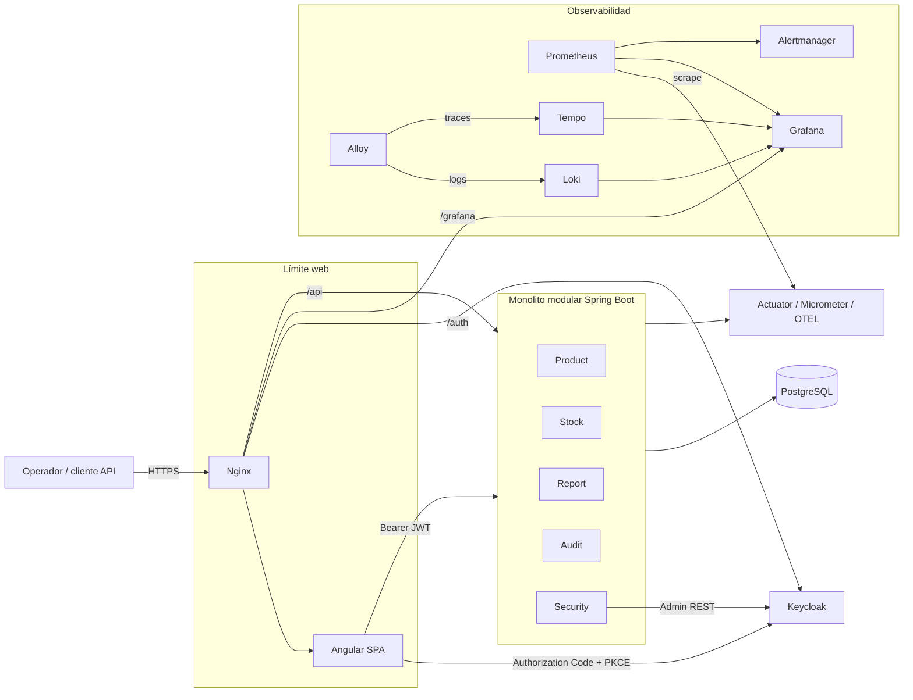

# Arquitectura general

La API de negocio es un único proceso con módulos de dominio; Keycloak,
PostgreSQL y telemetría son servicios de infraestructura separados. El
navegador y la red pública están fuera del límite de confianza. Nginx es el
único punto público del despliegue VM.
