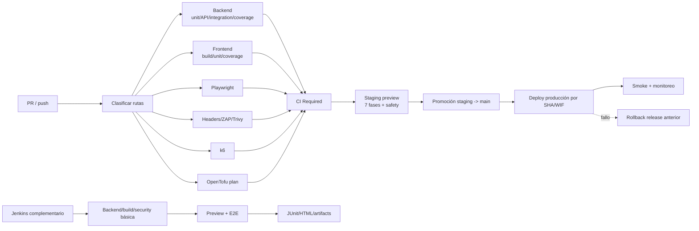

# CI/CD

```mermaid
flowchart LR
  PR[PR / push] --> CL[Clasificar rutas]
  CL --> B[Backend\nunit/API/integration/coverage]
  CL --> F[Frontend\nbuild/unit/coverage]
  CL --> E[Playwright]
  CL --> S[Headers/ZAP/Trivy]
  CL --> K[k6]
  CL --> I[OpenTofu plan]
  B --> G[CI Required]
  F --> G
  E --> G
  S --> G
  K --> G
  I --> G
  G --> ST[Staging preview\n7 fases + safety]
  ST --> M[Promoción staging -> main]
  M --> P[Deploy producción por SHA/WIF]
  P --> SM[Smoke + monitoreo]
  P -. fallo .-> RB[Rollback release anterior]

  J[Jenkins complementario] --> JB[Backend/build/security básica]
  JB --> JE[Preview + E2E]
  JE --> JA[JUnit/HTML/artifacts]
```

GitHub Actions es el camino principal. Jenkins no ejecuta hoy frontend unit,
ZAP/Trivy/k6 ni el gate explícito de integración; estas brechas están
documentadas.
