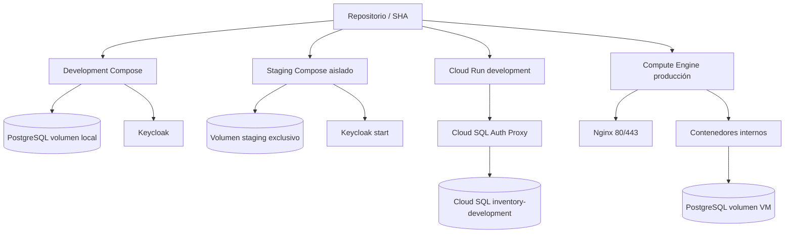

# Despliegue por ambiente

Staging local/CI publica solo loopback. Cloud Run development agrupa
frontend/backend/Keycloak/proxy en una revisión. Producción vigente es la VM,
no un servicio Cloud Run production.
