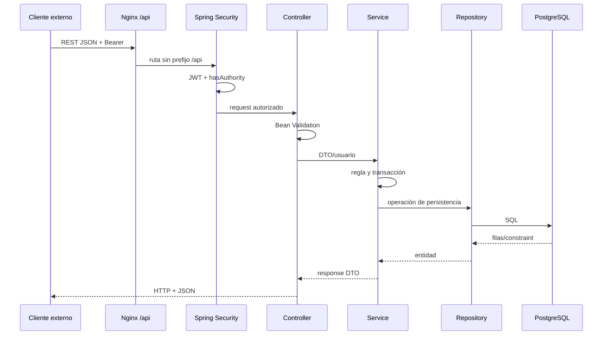

# Flujo de API

```mermaid
sequenceDiagram
  participant C as Cliente externo
  participant N as Nginx /api
  participant SS as Spring Security
  participant CT as Controller
  participant SV as Service
  participant RP as Repository
  participant DB as PostgreSQL

  C->>N: REST JSON + Bearer
  N->>SS: ruta sin prefijo /api
  SS->>SS: JWT + hasAuthority
  SS->>CT: request autorizado
  CT->>CT: Bean Validation
  CT->>SV: DTO/usuario
  SV->>SV: regla y transacción
  SV->>RP: operación de persistencia
  RP->>DB: SQL
  DB-->>RP: filas/constraint
  RP-->>SV: entidad
  SV-->>CT: response DTO
  CT-->>C: HTTP + JSON
```

Nginx elimina el prefijo externo `/api`; los controllers usan rutas como
`/products`. Constraints/errores se traducen mediante el exception handler.
