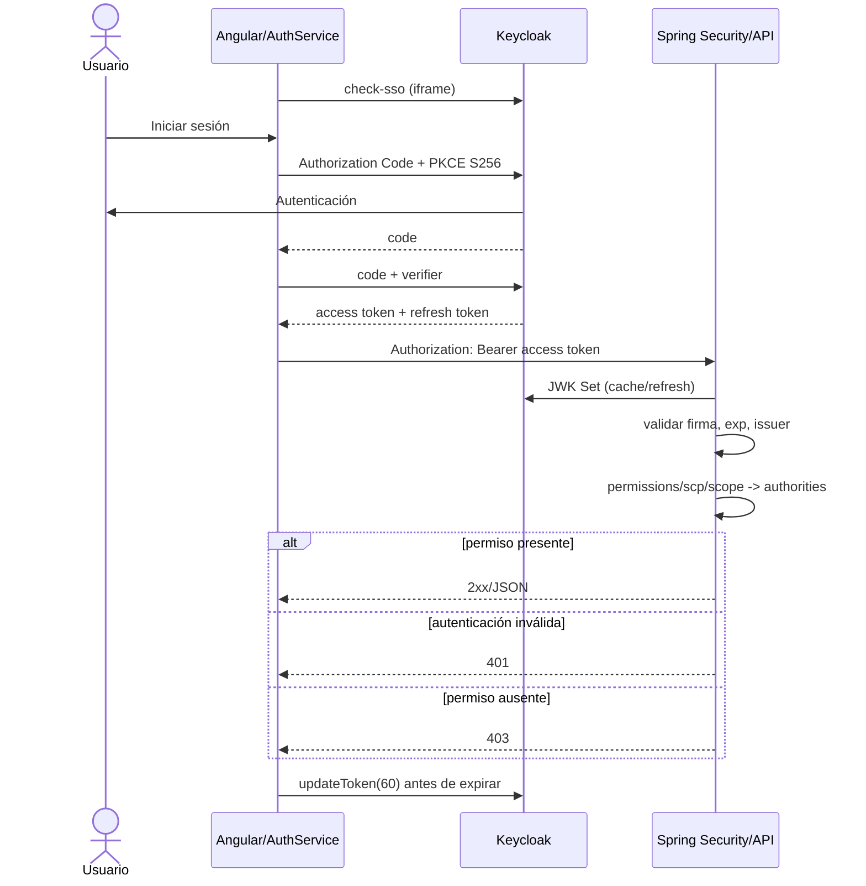

# Flujo de autenticación

```mermaid
sequenceDiagram
  actor U as Usuario
  participant SPA as Angular/AuthService
  participant KC as Keycloak
  participant API as Spring Security/API

  SPA->>KC: check-sso (iframe)
  U->>SPA: Iniciar sesión
  SPA->>KC: Authorization Code + PKCE S256
  KC->>U: Autenticación
  KC-->>SPA: code
  SPA->>KC: code + verifier
  KC-->>SPA: access token + refresh token
  SPA->>API: Authorization: Bearer access token
  API->>KC: JWK Set (cache/refresh)
  API->>API: validar firma, exp, issuer
  API->>API: permissions/scp/scope -> authorities
  alt permiso presente
    API-->>SPA: 2xx/JSON
  else autenticación inválida
    API-->>SPA: 401
  else permiso ausente
    API-->>SPA: 403
  end
  SPA->>KC: updateToken(60) antes de expirar
```

El token no se documenta ni persiste en archivos de evidencia. La validación
explícita de audience no fue encontrada y permanece como riesgo.
