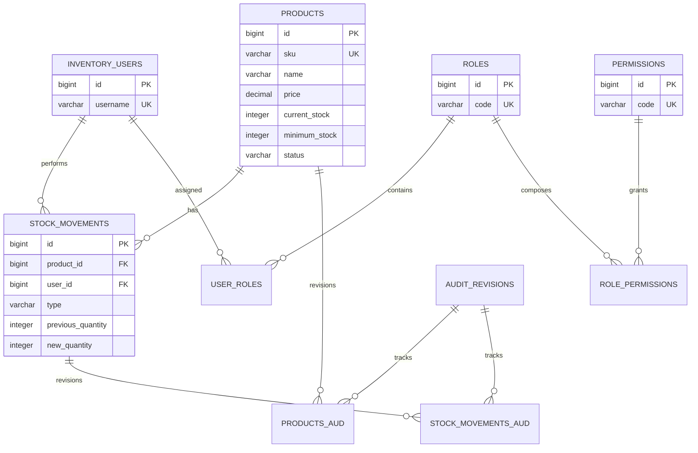

# Modelo de datos

```mermaid
erDiagram
  PRODUCTS ||--o{ STOCK_MOVEMENTS : has
  INVENTORY_USERS ||--o{ STOCK_MOVEMENTS : performs
  INVENTORY_USERS ||--o{ USER_ROLES : assigned
  ROLES ||--o{ USER_ROLES : contains
  ROLES ||--o{ ROLE_PERMISSIONS : composes
  PERMISSIONS ||--o{ ROLE_PERMISSIONS : grants
  AUDIT_REVISIONS ||--o{ PRODUCTS_AUD : tracks
  AUDIT_REVISIONS ||--o{ STOCK_MOVEMENTS_AUD : tracks
  PRODUCTS ||--o{ PRODUCTS_AUD : revisions
  STOCK_MOVEMENTS ||--o{ STOCK_MOVEMENTS_AUD : revisions

  PRODUCTS {
    bigint id PK
    varchar sku UK
    varchar name
    decimal price
    integer current_stock
    integer minimum_stock
    varchar status
  }
  STOCK_MOVEMENTS {
    bigint id PK
    bigint product_id FK
    bigint user_id FK
    varchar type
    integer previous_quantity
    integer new_quantity
  }
  INVENTORY_USERS {
    bigint id PK
    varchar username UK
  }
  ROLES {
    bigint id PK
    varchar code UK
  }
  PERMISSIONS {
    bigint id PK
    varchar code UK
  }
```

El diagrama resume relaciones confirmadas por migraciones; no pretende
reemplazar tipos/constraints SQL completos. Consultar V1-V7 para el contrato
exacto.
