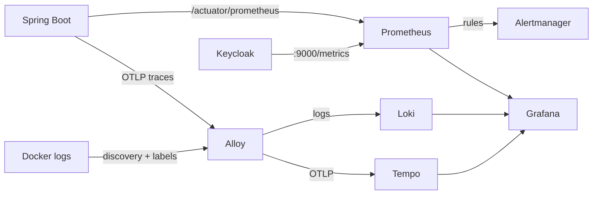

# Observabilidad

```mermaid
flowchart LR
  APP[Spring Boot]
  KC[Keycloak]
  DOCKER[Docker logs]
  PROM[Prometheus]
  ALLOY[Alloy]
  LOKI[Loki]
  TEMPO[Tempo]
  ALERT[Alertmanager]
  GRAF[Grafana]

  APP -->|/actuator/prometheus| PROM
  KC -->|:9000/metrics| PROM
  APP -->|OTLP traces| ALLOY
  DOCKER -->|discovery + labels| ALLOY
  ALLOY -->|logs| LOKI
  ALLOY -->|OTLP| TEMPO
  PROM -->|rules| ALERT
  PROM --> GRAF
  LOKI --> GRAF
  TEMPO --> GRAF
```

Alloy etiqueta logs con `compose_service`, no `container`. Esta diferencia
explica el hallazgo del panel Loki versionado.
