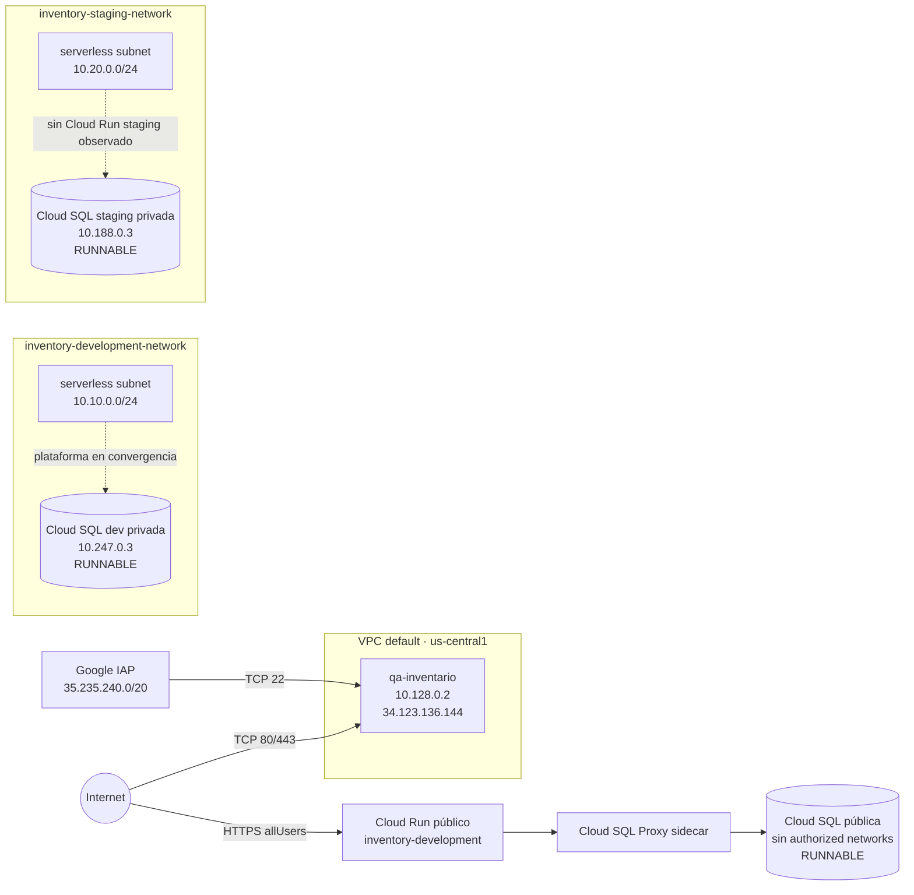

# Red GCP observada

Firewall de la VM no abre puertos de aplicación internos. La instancia SQL
pública exige proxy/conector; no tiene redes autorizadas observadas. La
Las instancias privadas aparecieron durante la auditoría y terminaron
`RUNNABLE`, pero no se observaron servicios Cloud Run consumidores.
