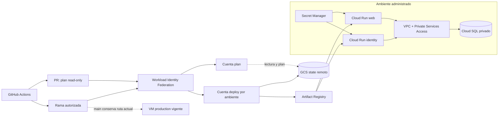
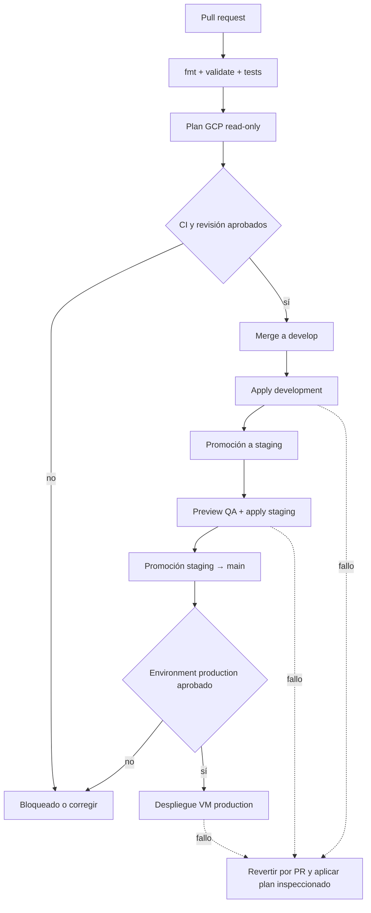
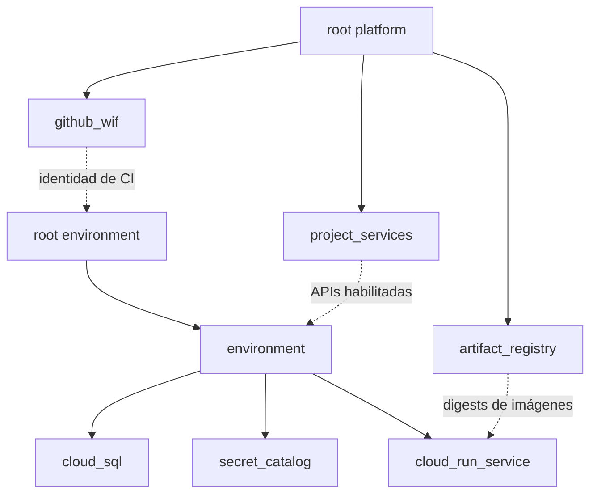

# OpenTofu para Google Cloud

Esta carpeta define la plataforma GCP y los ambientes administrados del
proyecto. La documentación se organiza como una ruta navegable:

```text
README del proyecto
└── infra/opentofu/README.md (este mapa)
    ├── platform/README.md
    ├── environments/README.md
    ├── modules/README.md
    ├── scripts/opentofu/README.md
    └── docs/deployment/gcp-managed-environments.md
```
La guía operativa completa está en
[`docs/deployment/opentofu-gcp.md`](../../docs/deployment/opentofu-gcp.md). El
estado observado, las aprobaciones, incidentes, recuperación y trazabilidad del
issue #109 están en
[`docs/27-guia-operativa-gcp-opentofu.md`](../../docs/27-guia-operativa-gcp-opentofu.md).

La guía de diseño está en
[`docs/deployment/opentofu-gcp.md`](../../docs/deployment/opentofu-gcp.md) y el
procedimiento operativo en
[`docs/deployment/gcp-managed-environments.md`](../../docs/deployment/gcp-managed-environments.md).

## Arquitectura



El diagrama muestra dos rutas distintas. Los pull requests obtienen una
identidad de solo lectura y nunca ejecutan `apply`. Las ramas autorizadas usan
una cuenta de despliegue restringida por ref. Production continúa en la VM; un
plan de Cloud Run para production no significa que ese runtime esté activo.

## Flujo de promoción



Cada promoción conserva el SHA aprobado. Development y staging pueden activar
Cloud Run después de que sus ocho secretos estén completos; production no
cambia de runtime automáticamente.

## Estructura y responsabilidades

| Ruta | Responsabilidad | Consumido por | Resultado |
|---|---|---|---|
| [`bootstrap/`](bootstrap/) | Crear el bucket versionado de state | Operador inicial | Backend GCS protegido |
| [`platform/`](platform/) | APIs, Artifact Registry y WIF | Workflow administrado | Servicios compartidos e identidades |
| [`environments/`](environments/) | Instanciar un ambiente aislado | Workflows por rama | Red, SQL, secretos y Cloud Run opcional |
| [`modules/`](modules/) | Componentes OpenTofu reutilizables | Roots platform/environment | Recursos GCP compuestos |
| [`../../scripts/opentofu/`](../../scripts/opentofu/) | Render, plan, seed y validación | Operador y Actions | Config efímera, planes y comprobaciones |

Los `*.tfvars.example` y `backend.hcl.example` son contratos sin credenciales.
Sus copias reales, states, planes y `.terraform/` están ignorados por Git.

## Dependencias entre módulos



`environment` es el módulo compositor. Las flechas punteadas representan
dependencias operativas que cruzan roots y se comunican mediante configuración
de CI, no mediante acoplamiento directo entre módulos.
Los archivos `*.tfvars.example` y `backend.hcl.example` son contratos sin
credenciales. `.tfvars`, state, `.terraform/` y `*.tfplan` están ignorados por
Git. Una copia llamada `backend.hcl` **no está ignorada actualmente**: nunca
debe contener `credentials` y el operador debe comprobar `git status` para no
añadirla por accidente.

## Validación segura

```bash
make test-infra
```

Este contrato:

1. comprueba formato;
2. rechaza secretos, credenciales, states y planes versionados;
3. prueba los scripts de render y seed;
4. inicializa los roots con `-backend=false`;
5. ejecuta `tofu validate` y tests con providers simulados;
6. confirma aislamiento, SQL privado/cifrado, imágenes inmutables y
   protecciones de staging/production.

No autentica contra GCP ni ejecuta `apply`. La descarga inicial de providers
puede requerir acceso a red.

## Orden de aplicación

```text
bootstrap local
      ↓
platform remoto
      ↓
environment con deploy_services=false
      ├── VPC + Private Services Access
      ├── Cloud SQL sin IP pública
      └── contenedores de secretos e IAM
      ↓
crear versiones de secretos y usuarios PostgreSQL
      ↓
publicar imágenes inmutables
      ↓
environment con deploy_services=true
```

Se aplica el archivo `.tfplan` exacto que fue inspeccionado. Consulte el
[runbook administrado](../../docs/deployment/gcp-managed-environments.md) para
activación, comprobación, rollback e incidentes de state.

## Referencias oficiales

- [OpenTofu: módulos](https://opentofu.org/docs/language/modules/)
- [OpenTofu: backends](https://opentofu.org/docs/language/settings/backends/)
- [Google Cloud: Workload Identity Federation](https://cloud.google.com/iam/docs/workload-identity-federation)
- [GitHub: OIDC en Google Cloud](https://docs.github.com/actions/security-for-github-actions/security-hardening-your-deployments/configuring-openid-connect-in-google-cloud-platform)
Nunca se ejecuta `tofu apply` desde un pull request. Los PR realizan planes
GCP de solo lectura; `ci-required.yml` conecta los pushes a `develop` y
`staging` con `gcp-managed-deploy.yml`. El primer job post-merge de development
quedó `skipped`, por lo que el `apply` automático continúa pendiente de
validación y el issue #107 sigue abierto. `main -> production` conserva la
ruta VM: el root OpenTofu de production solo se planifica.
