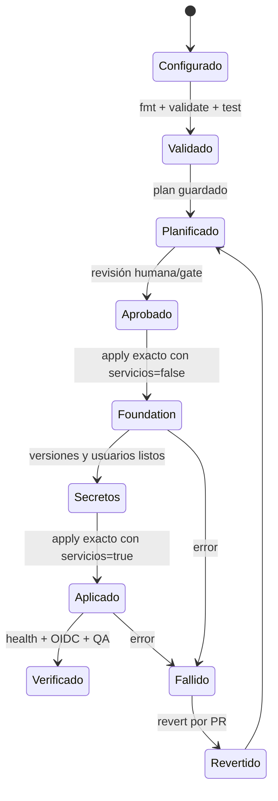

# Ambientes OpenTofu

Cada carpeta es un root con state independiente que instancia el módulo
[`environment`](../modules/environment/). Los roots comparten arquitectura,
pero cambian capacidad y protecciones.

| Ambiente | Rama | State | Runtime objetivo |
|---|---|---|---|
| `development` | `develop` | `inventory/environments/development` | Cloud Run administrado |
| `staging` | `staging` | `inventory/environments/staging` | Cloud Run y preview QA paralelo |
| `production` | `main` | `inventory/environments/production` | Solo plan; la VM sigue vigente |

## Archivos por root

| Ruta | Maneja |
|---|---|
| `main.tf` | Provider, módulo `environment` y output agregado |
| `variables.tf` | Imágenes, capacidad, protecciones y versión de secretos |
| `backend.hcl.example` | Bucket y prefijo de state |
| `terraform.tfvars.example` | Valores de ejemplo sin datos sensibles |
| `tests/contract.tftest.hcl` | Invariantes con provider simulado |

## Ciclo de activación

`deploy_services=false` crea red, Cloud SQL, cuentas e inventario de secretos,
pero no demuestra que la aplicación esté desplegada. Consulte el
[runbook](../../../docs/deployment/gcp-managed-environments.md) antes de
activar servicios.

