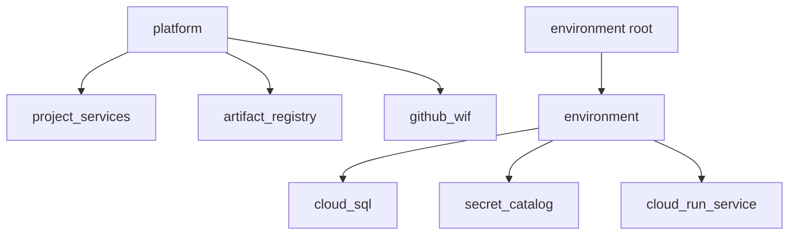

# Catálogo de módulos OpenTofu

Los módulos separan responsabilidades y son consumidos por los roots
[`platform`](../platform/) y [`environments`](../environments/).

| Módulo | Responsabilidad | README |
|---|---|---|
| `project_services` | APIs requeridas y protección contra deshabilitación accidental | [Abrir](project_services/) |
| `artifact_registry` | Repositorio Docker y política de limpieza | [Abrir](artifact_registry/) |
| `github_wif` | Providers OIDC, cuentas e IAM por rama | [Abrir](github_wif/) |
| `environment` | Composición de red, SQL, secretos y servicios | [Abrir](environment/) |
| `cloud_sql` | PostgreSQL privado, bases y backups | [Abrir](cloud_sql/) |
| `secret_catalog` | Contenedores de secretos e IAM, nunca valores | [Abrir](secret_catalog/) |
| `cloud_run_service` | Servicio v2 con sidecars, VPC, escalado e IAM | [Abrir](cloud_run_service/) |

Todos los módulos declaran tipos y descripciones. Los valores sensibles se
inyectan fuera de OpenTofu para que no aparezcan en state ni planes.

