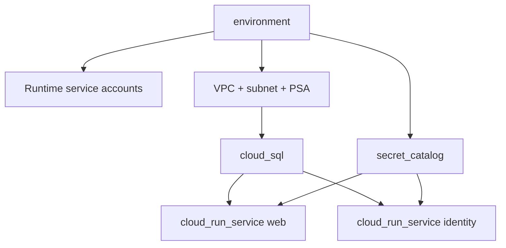

# Módulo `environment`

Es el compositor de un ambiente completo. Crea cuentas runtime, red, subred,
Private Services Access, Cloud SQL, catálogo de secretos y, opcionalmente, los
servicios web e identity.

| Grupo de entradas | Contenido |
|---|---|
| Identidad | `project_id`, `region`, `environment`, `labels` |
| Activación | `deploy_services` |
| Imágenes | frontend, backend, Keycloak y Cloud SQL Proxy |
| Base de datos | tier, disponibilidad, disco y protección |
| Servicios | mínimos/máximos y protección de borrado |
| Secretos | `secret_version` numérica |

Las salidas agregan database, network, cuentas, secret IDs, URLs y
`safety_contract`. Con `deploy_services=false`, `service_urls` permanece sin
runtime y `cloud_run_enabled` es falso.

Este módulo no publica imágenes ni materializa secretos. Esas operaciones
pertenecen al pipeline para mantener planes reproducibles y state sin valores.

