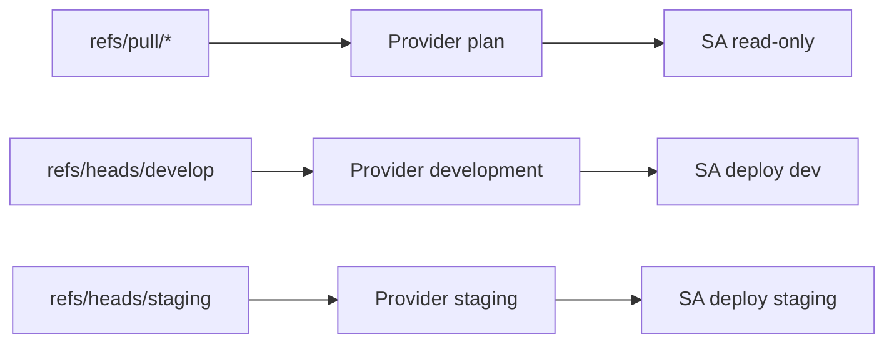

# Módulo `github_wif`

Configura autenticación OIDC sin llaves JSON para GitHub Actions. Autoriza el
repositorio mediante IDs numéricos inmutables y separa identidades por
propósito.

| Entrada | Descripción |
|---|---|
| `project_id`, `region` | Proyecto y región de recursos compartidos |
| `state_bucket_name` | Bucket cuyos prefijos reciben IAM condicionado |
| `artifact_repository_id` | Registry donde escriben deployers |
| `github_repository_id` | ID numérico del repositorio autorizado |
| `github_repository_owner_id` | ID numérico del propietario autorizado |

Las salidas entregan providers y correos de cuentas para variables de Actions.
La identidad de plan puede leer metadata/state; no puede aplicar. Las
identidades de despliegue escriben únicamente en sus prefijos y recursos
necesarios.

