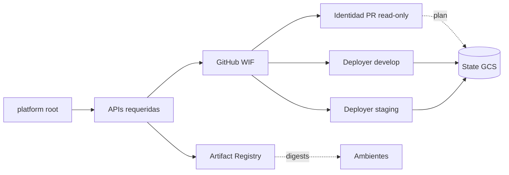

# Plataforma compartida

Este root administra los servicios compartidos que deben existir antes de
crear un ambiente: APIs de Google Cloud, Artifact Registry e identidades
federadas para GitHub Actions.

## Archivos

| Ruta | Maneja |
|---|---|
| `main.tf` | Composición de `project_services`, `artifact_registry` y `github_wif` |
| `variables.tf` | Proyecto, región, repositorio, bucket e IDs inmutables de GitHub |
| `outputs.tf` | URL del registry, APIs e identificadores WIF para configurar Actions |
| `providers.tf` | Provider Google usado por el root |
| `backend.hcl.example` | Contrato del state `inventory/platform` |
| `terraform.tfvars.example` | Ejemplo sin credenciales ni secretos |

## Flujo



Las cuentas de despliegue están restringidas por rama e ID numérico del
repositorio. La cuenta de PR solo puede consultar recursos y leer los states
necesarios para producir un plan.

## Uso

```bash
./scripts/opentofu/plan.sh \
  platform \
  "$PWD/infra/opentofu/platform/backend.hcl" \
  "$PWD/infra/opentofu/platform/terraform.tfvars"
```

Revise el plan y aplique exactamente ese archivo. Development puede reconciliar
esta plataforma; staging no debe competir como segundo escritor.

