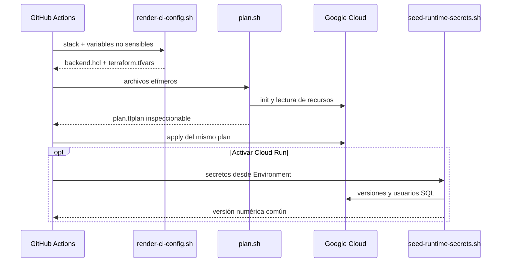

# Scripts OpenTofu

Estos scripts son la interfaz operativa común entre la terminal y GitHub
Actions. Todos usan modo estricto y fallan antes de producir una configuración
ambigua.

| Script | Entrada | Salida o efecto |
|---|---|---|
| `validate.sh` | Repositorio y cache opcional | Formato, tests y validación offline |
| `render-ci-config.sh` | Stack, directorio y variables GCP | `backend.hcl` y `terraform.tfvars` con modo `0600` |
| `plan.sh` | Stack, backend, variables y destino | Plan guardado y vista sin color |
| `seed-runtime-secrets.sh` | Ambiente, proyecto y ocho secretos | Versiones Secret Manager, usuarios SQL y número común |

## Flujo



## Variables principales

`render-ci-config.sh` requiere `GCP_PROJECT_ID`, `GCP_REGION` y
`GCP_STATE_BUCKET`. Para platform también requiere los IDs numéricos del
repositorio y propietario. `DEPLOY_SERVICES=true` exige las cuatro imágenes
completas con `@sha256`.

`seed-runtime-secrets.sh` acepta únicamente development o staging y exige:

```text
INVENTORY_DB_PASSWORD
KEYCLOAK_DB_PASSWORD
KEYCLOAK_ADMIN_PASSWORD
KEYCLOAK_ADMIN_CLIENT_SECRET
E2E_ADMIN_PASSWORD
E2E_OPERATOR_PASSWORD
E2E_VIEWER_PASSWORD
E2E_AUDITOR_PASSWORD
```

No use `set -x`, argumentos de línea de comandos ni archivos temporales para
los valores. El script solo imprime la versión numérica común.

